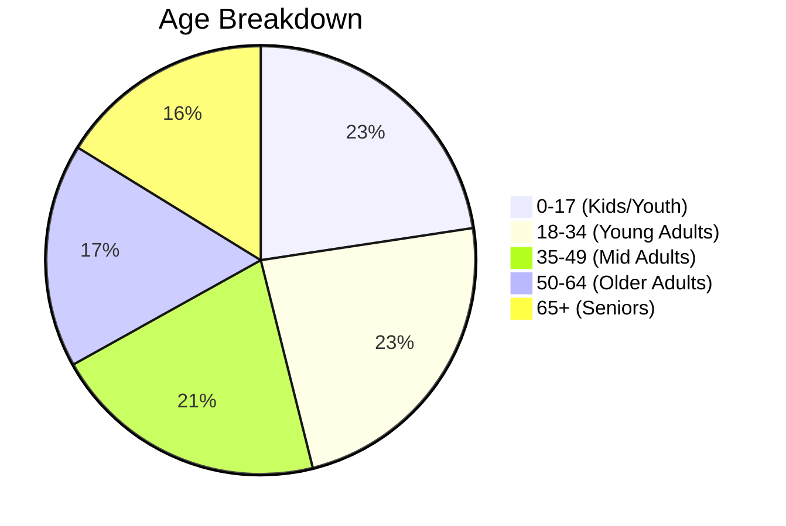

# Core Neighborhood Mission Summary
**Target Area:** 50% Contiguous Church Footprint (21 Census Tracts)

> [!NOTE]
> **What is this area?** 
> This profile represents the 21 geographically contiguous census tracts immediately surrounding Westchester EFC that encompass exactly 50% of the active church congregation. It represents the immediate "Jerusalem" of the church's neighborhood footprint.

---

## 📊 Demographic Snapshot
**Total Population:** 90,105

### Age Distribution

### Household & Economic Status
| Metric | Percentage | Count | Insight |
|--------|------------|-------|---------|
| **Married Adults** | 51.3% | 37,466 | Represents a strong, stable family baseline. |
| **Single-Parent Families** | 13.8% | 3,215 | Significant block requiring wrap-around support. |
| **Divorced/Separated** | 12.4% | 9,073 | Highlights a need for recovery and care ministries. |
| **Renters** | 32.8% | 12,620 | 1 in 3 households are mobile/transient. |
| **Below Poverty Line** | 9.6% | 8,496 | Solidly middle-class area, but with distinct pockets of need. |

### Diversity & Language
* **White Population:** 75.2%
* **Hispanic Population:** 8.3%
* **Limited English Proficiency (LEP):** 6.0% (Over 5,000 individuals)

---

## 👥 Ministry Personas
Based on the exact metrics of this 50% core, here are 3 "average" personas representing distinct segments of these neighborhoods, and what it takes to effectively minister to them:

### 1. The "Settled Millennial" Family
**The Data Behind Them:** 51.3% married, 22.6% children, 67% homeowners.
**The Persona:** Married, in their mid-30s to early 40s, with two kids in local schools. They are financially stable but incredibly time-crunched due to dual incomes and kids' sports/activities. 

> [!TIP]
> **Ministry Strategy**
> * **Don't add to their calendar:** They are exhausted. If you ask them to attend 3 events a week, they will burn out. Emphasize *equipping* them to do discipleship in their own home.
> * **NextGen Excellence:** Their primary motivator for engaging a church is often, *"Is this a safe, morally grounding community for my kids?"* 
> * **Marital Support:** Provide marriage enrichment and parenting classes as highly accessible entry points for unchurched families in this demographic.

### 2. The "Transient Young Adult" Renter
**The Data Behind Them:** 23.5% of the population is 18-34 (the largest single age block), and 32.8% of the footprint rents. 
**The Persona:** In their 20s, unmarried, renting an apartment. They are highly mobile (might move across town or out of state in 2 years) and suffer from the highest rates of loneliness of any generation. They are highly skeptical of institutional religion but crave spirituality.

> [!IMPORTANT]
> **Ministry Strategy**
> * **Third Spaces:** They aren't looking for a flashy Sunday service; they are looking for a living room. Small groups, hospitality, and shared meals are non-negotiable.
> * **Fast On-Ramps:** Because they are transient, if your discipleship pathway requires 2 years of rootedness to get involved, you will lose them. Get them serving and integrated within weeks.
> * **Apologetics & Vocation:** They are asking deep questions about meaning, sexuality, and how to integrate their faith into their secular workplaces.

### 3. The "On-the-Margins" Neighbor
**The Data Behind Them:** 13.8% of families are single-parent households, 9.6% live below the poverty line, and a massive 6.0% have Limited English Proficiency.
**The Persona:** A single mother working two jobs to make ends meet, or a first-generation immigrant/refugee family navigating a new culture and language barriers.

> [!CAUTION]
> **Ministry Strategy**
> * **Incarnational over Attractional:** They cannot and will not simply "show up" to a Sunday service. The church must go to them.
> * **Practical Wraparound Support:** Ministry here looks like ESL classes hosted at the church, free after-school tutoring programs, or a robust single-mom support ministry (oil changes, childcare, financial counseling).
> * **Language Integration:** With over 5,000 limited-English speakers in just your closest 21 tracts, offering translation headsets or planting a bilingual congregation could be a massive avenue for gospel expansion.
